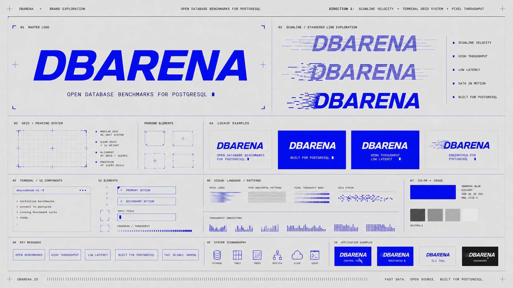
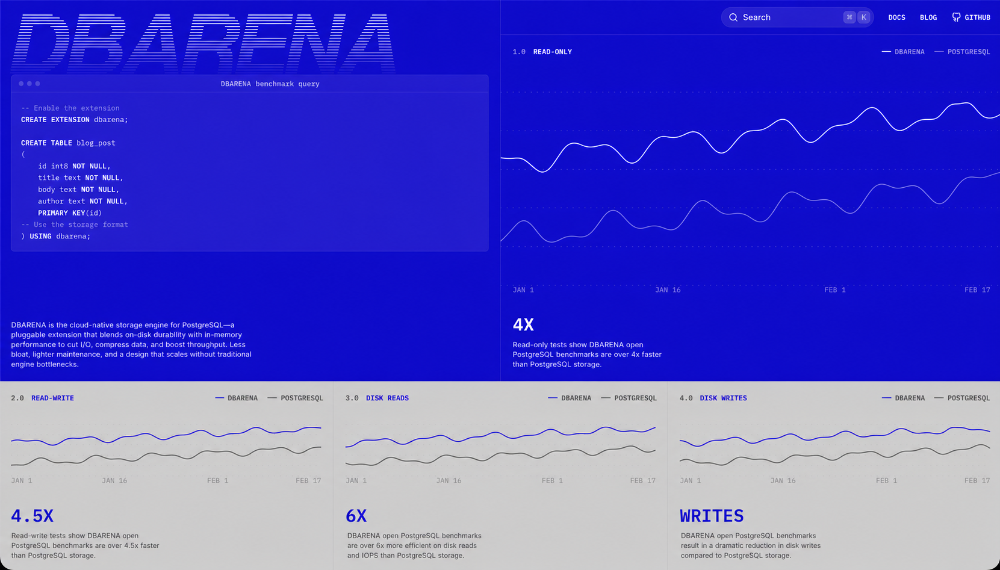

# DBARENA brand guidelines

DBARENA uses the supplied electric-blue, scanline, terminal-grid identity with
the name changed from ORIOLE to DBARENA. This guide documents that retained
system. It doesn't introduce a new symbol, palette, or brand metaphor.

## Brand foundation

DBARENA is an open database benchmark platform. It publishes comparable
PostgreSQL performance and price results with the configurations and raw data
needed to inspect each run.

### Primary descriptor

Use this descriptor in the primary logo lockup and major headers:

> Open database benchmarks for PostgreSQL.

### Supporting messages

Use short, technical messages that match the reference system:

- High throughput.
- Low latency.
- Reproducible results.
- Raw data included.
- Fast data. Open source. Built for PostgreSQL.

## Name

Write the brand as `DBARENA` in logos, navigation, labels, and prose. Don't use
“DB Arena,” “DB-Arena,” or “DBarena.”

## Logo system

The primary logo is the italic, uppercase `DBARENA` wordmark. It directly
replaces `ORIOLE` in the supplied references while retaining the same visual
weight, slant, spacing, and electric-blue color.

The production assets are:

- [`dbarena-wordmark.svg`](./assets/dbarena-wordmark.svg) for primary use.
- [`dbarena-mark.svg`](./assets/dbarena-mark.svg) for small `DB` applications.

### Primary wordmark

Use the solid electric-blue wordmark on light grey or white. On electric blue,
use the white wordmark. On black, use white or electric blue when contrast is
sufficient.

### Scanline wordmark

Use the scanline wordmark for hero graphics, campaign panels, and large digital
applications. Horizontal lines cut through the letterforms and can extend to
the left or right to suggest throughput and data in motion.

### Staggered wordmark

Use the staggered treatment for performance graphics and transition states.
Break the leading edge into short horizontal segments. Don't distort the core
letterforms or reduce legibility.

### Small mark

Use the italic `DB` monogram only when the full wordmark doesn't fit, such as a
favicon or 24 px application icon. The system doesn't use an additional
pictorial symbol.

### Clear space and minimum size

Define `X` as the height of the `D` counter. Keep at least `X` of clear space on
all sides of the wordmark.

- Keep the primary wordmark at least 120 px wide in digital use.
- Keep the scanline wordmark at least 180 px wide.
- Keep the `DB` monogram at least 20 px wide.

### Logo misuse

Keep every logo application close to the supplied references:

- Don't add a new symbol or enclose the wordmark in brackets.
- Don't introduce green, lime, orange, or multicolor treatments.
- Don't change the italic angle or letter proportions.
- Don't apply shadows, bevels, 3D effects, or glossy finishes.
- Don't use the scanline treatment at sizes where the name becomes unclear.

## Color

The system is intentionally narrow. Electric blue carries the identity, while
neutral greys provide the technical report surface.

| Token | Hex | Role |
| --- | --- | --- |
| DBARENA Blue | `#2626FF` | Wordmark, active data, rules, and UI focus |
| Paper | `#E7E7E7` | Primary background and brand-board surface |
| White | `#F7F7F5` | Blue-panel text and bright application surface |
| Ink | `#171717` | Primary copy and dark application background |
| Graphite | `#666666` | Secondary text and comparison data |
| Mid Grey | `#A8A8A8` | Inactive charts and supporting rules |
| Hairline | `#C8C8C8` | Grids, frames, and separators |

### Color rules

Use blue as the only brand accent. Large blue fields can carry white text and
white line charts. On grey or white surfaces, use blue for active data and
Graphite for comparisons. Don't assign arbitrary colors to database providers
when line weight, labels, or solid versus dotted patterns can distinguish them.

## Typography

The system combines a heavy italic display face with compact technical
monospace. This pairing must remain consistent across brand and product work.

### Display type

Use a heavy geometric sans at weight 800 or 900 with an italic or oblique
treatment. Set `DBARENA` in uppercase with tight tracking. Geist Sans Black
Italic or Arial Black Italic are acceptable prototype substitutes.

### Technical type

Use Geist Mono for labels, navigation, metrics, units, commands, and annotation
text. Set most technical labels in uppercase with moderate tracking.

### Body type

Use Geist Sans for paragraphs and interface copy. Keep paragraphs compact and
direct. Don't use the display italic for long text.

## Grid and framing

The layout follows the modular system shown in the supplied brand boards. Every
section aligns to a visible or implied technical grid.

- Use an 8 px base unit.
- Use thin one-pixel frames and dividers.
- Align headings, charts, labels, and controls to shared grid lines.
- Use corner crops, crosshairs, and measurement ticks at section boundaries.
- Prefer square panels and restrained corner radii.
- Keep generous clear space around the primary wordmark.

## Graphic language

The visual language remains the same as the supplied references. Use these
devices repeatedly instead of inventing new motifs.

### Scanlines and speed lines

Use thin horizontal lines to communicate throughput, latency, and data in
motion. Lines can form the wordmark, lead into it, or act as chart texture.

### Pixel throughput bars

Build performance bars from small blue cells. Keep cell size and spacing
consistent within each graphic. Filled cells show measured magnitude; outlines
or grey cells show remaining capacity.

### Terminal UI

Use monospaced prompts, rectangular inputs, progress bars, status lines, and
minimal window chrome. Terminal details must support a real product action or
benchmark state.

### Calibration marks

Use corner frames, crosshairs, thin rules, and numbered sections as technical
annotation. Keep these marks small and secondary to the content.

## Data visualization

Charts use the same blue and grey system as the brand. Data must remain more
important than decoration.

- Use DBARENA Blue for the active or primary series.
- Use Graphite or Mid Grey for a comparison series.
- Use white lines on full-blue panels.
- Label metrics, units, workloads, and dates directly.
- Start bar charts at zero when length represents magnitude.
- Link summaries to raw benchmark results.
- Avoid rainbow palettes, 3D charts, and decorative chart effects.

## Product UI

The website and product interface use large blue result fields with light grey
supporting sections. Product controls keep the terminal-grid precision of the
brand boards.

- Use blue for active controls, chart series, and selected states.
- Use white for content placed on blue.
- Use light grey for comparison sections and secondary charts.
- Use small uppercase monospaced labels for section names and units.
- Keep navigation, inputs, and cards visually flat and lightly framed.

## Voice

Write like a benchmark report: direct, measurable, and restrained. Name the
workload and condition before making a performance claim.

Use bounded claims:

> This configuration recorded the highest tpm in the matched I/O-bound run.

Avoid universal claims:

> This is the best database.

## Reference website

The corrected website mockup preserves the supplied split-screen benchmark
layout and changes the visible brand name to DBARENA.

## Production checklist

Before publishing an application, confirm these requirements:

- The name appears as `DBARENA`.
- The palette uses only blue, white, black, and neutral greys.
- The logo uses the solid, scanline, or staggered reference treatment.
- No new pictorial brand symbol has been introduced.
- Charts state the workload, metric, and measurement context.
- Text and controls meet WCAG 2.2 AA contrast requirements.
- Benchmark summaries link to methodology or raw evidence.

## Next steps

Use the corrected brand board and website mockup as the visual references. Before
launch, convert the final wordmark into outlined vector artwork and export solid,
scanline, staggered, white, and single-color production variants.
